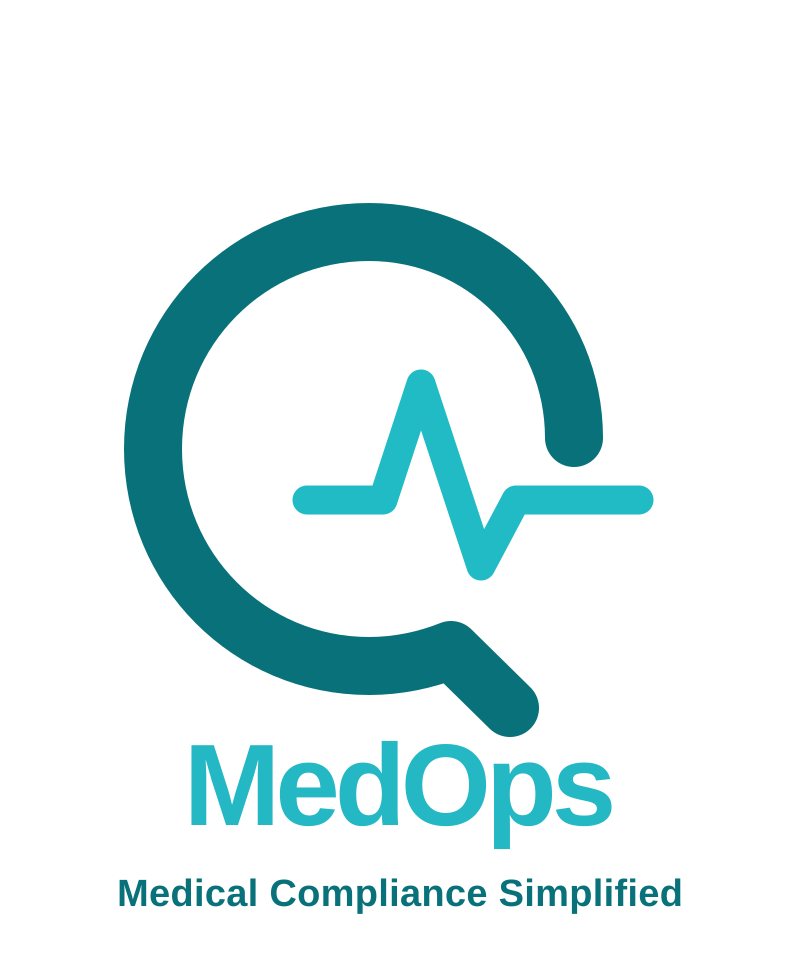

# Salamah · Q-MedOps

Quality and patient-safety operations platform (Arabic / English, RTL-first): OVR incident reporting, QPS review with SAL matrix, root cause analysis, CAPA, clinical indicators, CBAHI readiness and medical devices.

## Run

**Shared mode (recommended):** `npm start` or double-click `start.cmd` (Windows), then open http://localhost:8080. Data is stored in a SQLite database (`server/data/salamah.db`, created and seeded on first run) and shared by all users and devices; clients sync every 8 seconds. Needs Node 22.5+ (uses the built-in `node:sqlite`, no dependencies). Env: `PORT`, `DB_PATH`.

**Standalone:** open `index.html` directly. Data stays in that browser (IndexedDB).

Demo accounts use the password `demo`.

> Pilot only: login and permissions are enforced in the browser, and the API has no authentication. Add real sign-in and server-side permission checks before storing real patient data.

## Structure
- `index.html`, `styles.css`, `platform.css`: shell and styles
- `js/core.js`: storage, roles and permissions, workflow rules and task routing
- `js/app.js`: login, navigation, operations center, my tasks
- `js/incidents.js`: OVR list, detail, 3-step report form, printable AD-111 form (Parts I-V)
- `js/rca-capa.js`: investigations (RCA) and corrective actions (CAPA)
- `js/performance.js`: indicators, CBAHI readiness, medical devices
- `js/admin-reports.js`: monthly committee report, users, settings, backup
- `js/seed.js`, `js/seed-en.js`: demo data
- `server/server.mjs`: static server + JSON API (read, write, files, change sync)
- `server/schema.sql`: SQLite schema; full records as JSON with indexed generated columns, plus reporting views `v_incidents`, `v_capa`, `v_kpi_monthly`

## End-to-end test
```
npm test                                  # standalone (IndexedDB)
APP=http://localhost:8080/ npm test       # against the running server (SQLite)
```
Needs Node 22+ and Google Chrome (set `CHROME` to the executable path if it is not in the default Windows location). The test drives the real UI as every role: link crawl per role, low-risk / RCA / sentinel OVR workflows, device, indicator and CBAHI flows, access control and data integrity.
